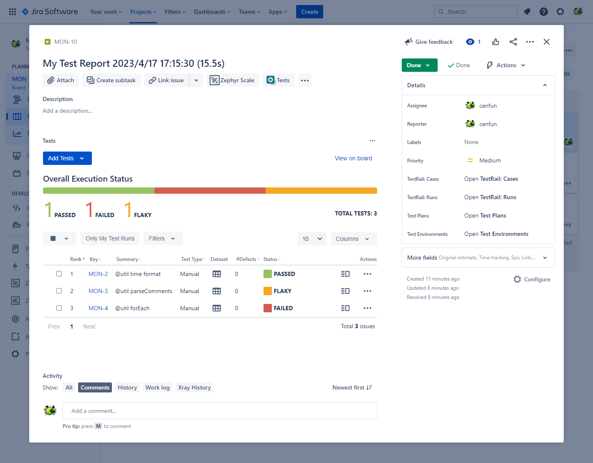

## Jira + Xray Integration
- Import test execution results with [Xray REST API](https://docs.getxray.app/display/XRAYCLOUD/REST+API)
- Update Jira issue status with [Jira Transition API](https://developer.atlassian.com/cloud/jira/platform/rest/v3/api-group-issues/#api-rest-api-3-issue-issueidorkey-transitions-post)

### Dependencies
- XRAY_CLIENT_ID
- XRAY_CLIENT_SECRET
- JIRA_TOKEN
- dotenv
- jira-client

