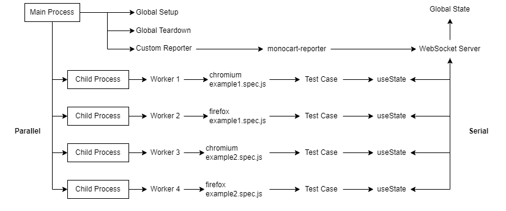

## Global State Management
Support specified test cases to run in sequence mode.



### WebSocket server + lock/unlock state
- [playwright.config.js](playwright.config.js)

### Test case + useState
- [example1.spec.js](example1.spec.js)
- [example2.spec.js](example2.spec.js)

### Logs
```
[MCR] state websocket server listening on ws://localhost:8130

Running 4 tests using 4 workers
[firefox][test 1] get list
[firefox][test 1] receive list [ 1, 2, 3 ]
[firefox][test 1] set list [ 1, 2, 3, 'firefox 1' ]
[chromium][test 2] get list
[chromium][test 2] receive list [ 1, 2, 3, 'firefox 1' ]
[chromium][test 2] set list [ 1, 2, 3, 'firefox 1', 'chromium 2' ]
[chromium][test 1] get list
[chromium][test 1] receive list [ 1, 2, 3, 'firefox 1', 'chromium 2' ]
[chromium][test 1] set list [ 1, 2, 3, 'firefox 1', 'chromium 2', 'chromium 1' ]
[firefox][test 2] get list
[firefox][test 2] receive list [ 1, 2, 3, 'firefox 1', 'chromium 2', 'chromium 1' ]
[firefox][test 2] set list [ 1, 2, 3, 'firefox 1', 'chromium 2', 'chromium 1', 'firefox 2' ]
[teardown] receive list [ 1, 2, 3, 'firefox 1', 'chromium 2', 'chromium 1', 'firefox 2' ]
```